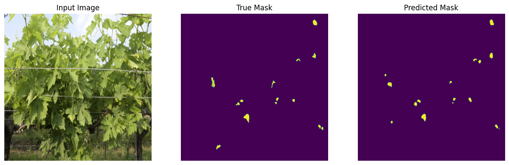
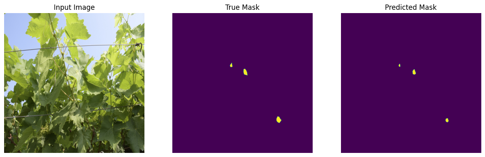
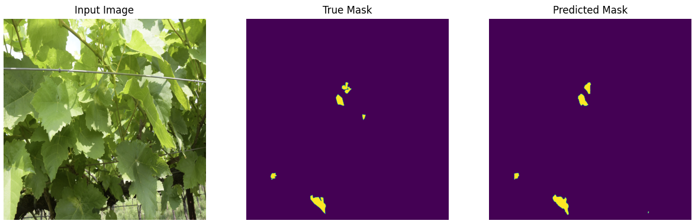
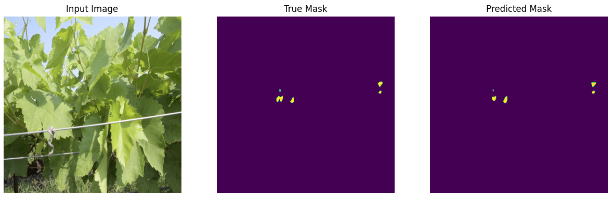
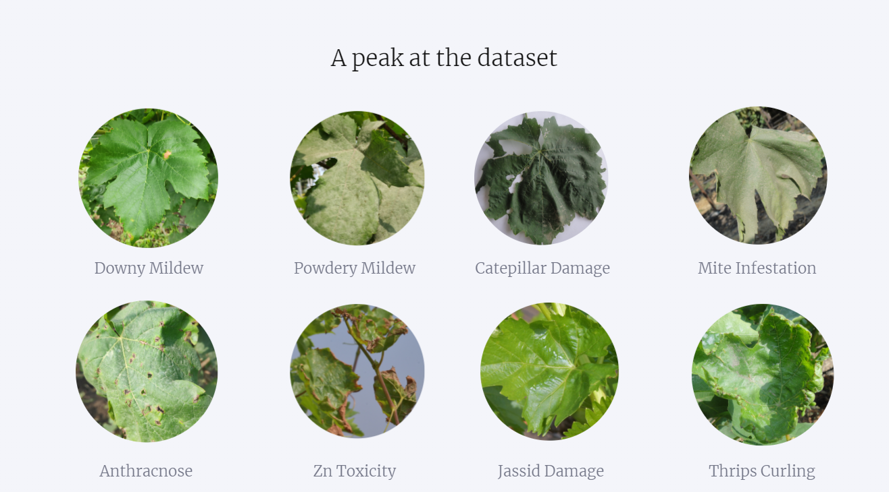
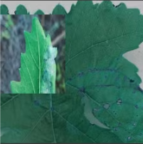
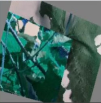
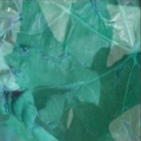

# Diseases and Deficiencies Detection

This project was part of my work at the Indian Council of Agricultural Research — National Research Centre for Grapes. I also led a team that contributed to the data collection and annotation.

This work was conducted in collaboration with an IoT team responsible for developing a camera-based wireless sensor network. The network collects data from the entire vineyard and feeds it to the detection model. Additionally, a team of domain experts provided valuable input throughout the project.  

# Overview →

Farmers face numerous challenges due to diseases and deficiencies in grapevines. These issues can lead to reduced yields, poor fruit quality, and even plant death. A wide range of factors contribute to these problems, including fungal infections, insect infestations, and nutrient deficiencies. In severe cases, these issues can result in significant financial losses for farmers and cause long-term damage to grape vineyards. Due to the large size of vineyards, timely detection of these becomes a challenging problem.  

To tackle this problem, I broke it down into 2 subproblems →

- Detection - From the image of an entire plant, accurately localize an ailment. This step is also used to find out how much the disease has spread/affected the plant.
- Classification - A proof of concept that shows detecting the 11 common diseases and deficiencies plaguing vineyards can be automated.

# Detection

Downy mildew is a fungal disease that manifests as yellowish patches on the upper surfaces of leaves. 

.png)

A 4K image of an entire plant

.png)

The same image with the blue spots marking the diseased region. 

Few challenges arise due to the symptoms of downy mildew being subtle→

1. Detecting downy mildew becomes a hard “needle in a haystack” type of problem. A capable and powerful AI model needs to carefully scan through the image. As far as we were aware, **this was the first project that detected diseases from images of entire plants, as opposed to a single leaf or few leaves.**
2. The large amount of work put into labelling 4000 images, each of which needed 5-10 mins for a domain expert to label. This is not a small investment at all and was only taken after I showed substantial results with a model trained on 400 images.
3. Many careful decisions were needed in the data collection process. For example, capturing the data in a window around noon, to minimise the negative effect of shadows on visibility.

### Results

After running 200+ experiments, I achieved a great validation IOU score of **0.84** which makes this model near-perfect.

Through systematic experimentation, I also found trends that made the search space of the experiments smaller.

1. **Using Sample Weights -** Since the number of pixels with downy mildew is much lesser than the number of pixels without it, it tends to dominate the gradients by a huge margin. Using dynamic sample weights stabilizes the training and reduces overfitting.
2. **Increasing the resolution of the input images -** Using higher resolution allows the model to pay even more attention to the finer details. This trend was obvious enough even without experimentation, which is why we captured images in 4k to begin with.
3. **Cutting the images into patches -** This acts both as a regularizer and also a performance optimizer.
    1. Performance → CNNs scale quadratically with the input image size. With 4k images, it isn’t possible to train a mid-size model with a batch size of 1 on a Nvidia A100 GPU. By patchifying, there is a 64x speedup in throughput and reduction in memory required.
    2. Regularization → By dividing an image into patches, and by shuffling these patches with patches from other images, there is a **staggering** amount of regularization. 
4. Data Augmentation → To train bigger models with only 4000 images, these are the augmentations applied -

- CutMix
- Optical Distortion
- Grid Dropout

- Grid Distortion
- Sharpen
- CutOut
- Random Gamma

- Pixel Dropout
- Random Contrast
- Random Brightness

- Random Shadow
- Gauss Noise
- CLAHE

- MixUp
- Elastic Transform
- Random Grid Shuffle

[Actual scores](https://docs.google.com/spreadsheets/d/1b1FAhAMQ2PNRIcT5hAq2rpFU6QCiDQjDWlSzO_-lB8g/preview?usp=sharing)

# Classification

I designed a CNN-based solution for the classification of the 11 most common diseases and deficiencies in grapevines using images.

To show that it is possible to extend the detection model for downy mildew to other ailments, we collected ~6,600 4K images across 15 classes. After a few experiments, by training an EfficientNetB7 model, along with heavy data augmentations, I achieved **100% test accuracy.**

